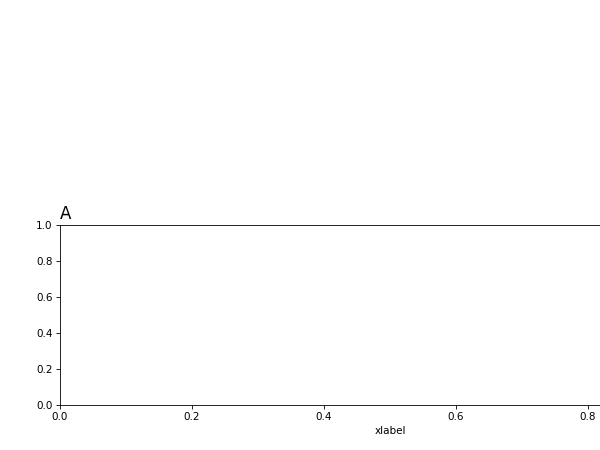
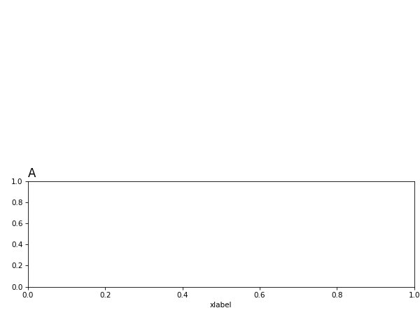

One difficulty in laying out a figure with multiple subplots in matplotlib is that sometimes text can overlap between subplots. Matplotlib is beginning to handle this issue with the [tight layout](https://matplotlib.org/tutorials/intermediate/tight_layout_guide.html) feature, but that feature does not appear to be compatible with the matplotlib generic way of defining subplots at arbitrary locations; it is meant to be used with the grid-based subplot layout definitions.

What we'd like as a user is to

	1. Create a rough layout graphically
	2. Fill in all the data and the labels
	3. Call a routine to automatically make everything "fit" in the available space.

Step 2 must happen before everything can be "made to fit". This is because it's hard to account for the size of text-base elements beforehand. You might add or omig text labels, which occupies or frees space. Depending on your data range, the tick labels might a different number of characters occuping different amounts of canvas area.

A very simple algorithm to make all the plot elements fit on the canvas is

	1. Calculate a bounding box around all subplot elements
	2. For each pair of plots, determine if the plots overlap based on the bounding boxes
	3. If there's overlap, calculate a scale factor to reduce the width and height of the leftmost/topmost plot. Assume that the top left corner of each subplot is anchored. When this scale factor is applied, there should be no overlap for this pair of plots. (Sidenote: if two plots are overlapping assuming zero area allocated for text, they will not be resized; the assumption then is that the overlap is intentional such as for inset plots).
	4. Apply the smallest pairwise scale factor globally.

This is by no means the best data visualization algorithm, but it should always produce an overlap-free plot. This algorithm is implemented in this simple module

## Resizing examples
Below are a few examples of auto-scaling plots to accomodate errant space occupied by text.

### Axis extending too far horizontally
Before:

After:

### Axis extending too far vertically
Before:

After:

### Axes overlapping horizontally
Before:

After:

### Axes overlapping vertically
Before:

After:

